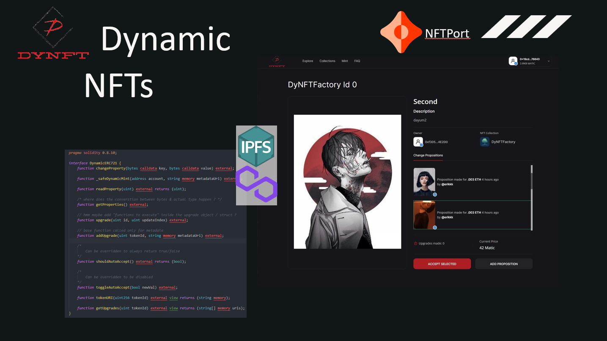
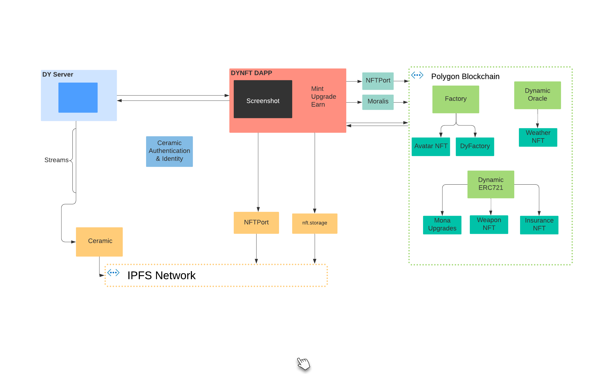

# Pattern for writting Dynamic NFTs

## In Short:
Dynamic NFTs is a code-pattern & tooling that enables web3 creators to have true ownership of assets and create upgradable NFTs in a trustless manner beyond just visual and audio files. We are Empowering the next-generation of GameFi. NFTs are compatible with all major marketplaces.

## Presentation link
[Youtube Video](https://www.youtube.com/watch?v=)



### [Website](https://dynamicnfts.on.fleek.co/)
[Deployed contract](https://ropsten.etherscan.io/address/)

## Table of Contents
- [About the Project](#about-the-project)
    - [Use cases](#use-cases)
    - [Architecture](#architecture)
- [Directory Structure](#directory-structure)
- [Installation](#installation)
    - [Prerequisites](#prerequisites)
    - [Smart Contracts](#smart-contracts)
    - [Frontend](#frontend)
    - [Local development](#local-development)
- [Deployment](#deployment)
    - [Smart Contract](#smart-contract)
    - [Web App](#web-app)
- [Screencast link](#screencast-link)
- [Public Ethereum wallet for certification](#public-ethereum-wallet-for-certification)
- [Happy Path User flow](#happy-path-user-flow)
- [Documentation](#documentation)
- [Environment variables](#environment-variables)
- [TODO Features](#todo-features)

## About the Project
Dynamic NFTs is, at its core, a pattern for empowering protocols that use NFTs.
It is made up of a Solidity library, with contracts extending the OpenZeppelin library with Dynamic behaviour & the trustless upgradability mechanism.
The contracts are intended to be generic and abstract, allowing for a wide range of custom implementations. According to the default implementation, only protocol owners can accept propositions to the underlying assets (in ipfs), and only the current owner of the NFT can accept the upgrades. Currently we support ERC721 and Factory contracts (Collections) which can be added through the Dapp UI. Propositions and Collections are stored on Ceramic. 
We also have deployed a default DynamicFactory for minting assets that get their metaata automatically pinned on IPFS.
The main purpose of the DAPP is to allow protocols to have an Upgradability UX out-of-the-box. This allows new protocols extending the dyNFT contracts to have an easy and user friendly way of upgrading the assets of their NFTs.

### Use cases :
- New GameFi protocols.
- Collectibles with Mutation/Upgrades logic. 
- Insurance Policies.
- Oracle based Dynamic NFTs.
- All the other use cases of non-static NFTs


### Architecture:
- Smart Contract Development: [Hardhat](https://hardhat.org/)
- Data Layer: [Ceramic](https://ceramic.network/)
- Decentralized File Storage : [IPFS](https://ipfs.io/)
- Frontend : [Svelte](https://svelte.dev/)
- Interaction with Ehtereum : [ethers.js](https://docs.ethers.io/v5/)
- Crypto wallet : [Metamask](https://metamask.io/)




## Directory Structure 
- `client`: Project's Svelte dapp frontend.
- `server`: Project's backend.
- `dynamic-nfts`: Smart contracts that are deployed in the Polygon Mumbai testnet.
- `dynamic-nfts/contracts`: Smart contracts showing example implementations.
- `dynamic-nfts/contracts/lib`: The Smart contracts library.
- `dynamic-nfts`: Smart contracts that are deployed in the Polygon Mumbai testnet.
- `dynamic-nfts/deploy`: Deployment Scripts.
- `dynamic-nfts/test`: Tests for smart contracts.


## Installation

### Prerequisites

- Install [Node.js >= v14](https://nodejs.org/en/download/)
- Yarn / Npm
- Install [MetaMask](https://metamask.io/) extension in your browser

### Frontend

- `cd server`
- `yarn install`
- `yarn start`
- Started at `http://localhost:{env.PORT}`

### Server

- `cd client`
- `yarn install`
- `yarn start`
- Open `http://localhost:3000`

## Environment variables 
`Dapp :`
```
VITE_NFT_STORAGE_KEY=
VITE_NFT_PORT_KEY=
VITE_API_URL=
```
`Server :`
```
SEED=
PORT=
CERAMIC_API_URL=
NFT_STORAGE_KEY=
```
`NFTs Contracts :`
```
RPC_URL=
RPC_URL_TEST=
PRIVATE_KEY=
NFT_STORAGE_KEY=
```

## TODO features

- Refactor Contracts
- Add Royalty Support